# Plant Disease Classification - Final Analysis

**A Study of Generalization, Dataset Shift, and Possible Shortcut Learning**

This document presents final results and interpretation for the project after model selection,
in-domain test evaluation, and external evaluation on PlantDoc. It is written for a university
ML course final report and supporting presentation materials.

---

## 1. Project goal

This project is **not** only about maximizing accuracy on a single clean dataset. The main goal
is to ask:

> *After training plant disease classifiers on **standardized PlantVillage** images, can they
> still perform when evaluated on **real-world, field-style** images from a different source
> (PlantDoc)?*

The experiment is designed to study:

- **Generalization under dataset shift** - the training and external test distributions differ
  in background, lighting, framing, and image style.
- **Possible shortcut learning** - the hypothesis that a model can achieve high
  in-distribution accuracy by relying on **dataset-specific** visual regularities (e.g.
  background, lighting statistics, resolution) that **do not** transfer to a new collection.

**Interpretation throughout this report:** Findings can be *consistent with* dataset shift and
*possible* shortcut learning. They do **not** establish that a specific spurious cue (for example,
reliance on background alone) caused any given prediction.

---

## 2. Datasets and why they were used

### 2.1 PlantVillage (in-domain)

| Role | Purpose |
| --- | --- |
| **Train** | Learn class boundaries from 8 selected disease classes. |
| **Validation** | **Hyperparameter tuning and model selection** (learning rate, weight decay, dropout, augmentation). |
| **Test** | **In-domain** held-out performance **after** the best settings were fixed - reports how well the model fits PlantVillage-like images it has never seen, but that come from the **same** underlying collection as training. |

The validation split was used **only** to compare tuning runs. The test split was **not** used
to pick hyperparameters.

### 2.2 PlantDoc (external / cross-dataset)

| Role | Purpose |
| --- | --- |
| **External evaluation** | **After** the final models were selected using PlantVillage validation, both models were evaluated on PlantDoc **once** to measure **out-of-distribution** performance. |
| **Shortcut / generalization analysis** | The same one-time run supports discussion of *possible* shortcut reliance and error patterns. PlantDoc was **not** used for training, tuning, or checkpoint selection. |

### 2.3 Why compare PlantVillage vs PlantDoc

- **PlantVillage** is largely **laboratory-style**: controlled scale, more uniform background,
  and consistent imaging compared to ad-hoc field photos.
- **PlantDoc** is **web-scraped** and **field-like**: more clutter, variable lighting, resolution,
  and composition.

Comparing the two therefore measures how well a model **transfers** when the **imaging
context** changes - the core of the project’s generalization question. A **large** gap
between PlantVillage test and PlantDoc does **not** by itself identify *which* cue failed; it
supports the need for **careful** external testing and the *hypothesis* of
**dataset-specific** exploitability.

---

## 3. Models compared

### 3.1 BaselineCNN (custom CNN, trained from scratch)

- Small convolutional network (`src/models/cnn_baseline.py`).
- **All** weights start random; the model sees **only** PlantVillage (plus the chosen
  augmentations) during training.
- **Final** selected checkpoint after tuning: `outputs/checkpoints/baseline_cnn_best_run3.pt`
  (see **Section 4**).
- This model represents: *“What can a compact network learn with no external visual prior
  beyond PlantVillage?”*

### 3.2 ResNet-18 (ImageNet-pretrained, fine-tuned on PlantVillage)

- `torchvision` ResNet-18 with a replaced 8-class head, full fine-tuning on PlantVillage.
- **Final** evaluation checkpoint: `outputs/checkpoints/resnet18_best.pt` (from the original
  full training run).
- This model represents: *“Does a standard pretrained backbone with generic natural-image
  features help under shift?”*

### 3.3 Why compare them

- **ResNet-18** brings **broad, transferable** low- and mid-level features from **ImageNet**;
  **BaselineCNN** does not.
- If ResNet-18 maintains higher accuracy on **PlantDoc** and a **smaller** train/test vs
  external gap, that is *consistent with* the idea that **richer, pretrained
  representations** help under **changed** visual conditions - without proving *why* any single
  error occurred.

**Sources for architecture details:** `src/models/cnn_baseline.py`,
`src/models/resnet18_finetune.py`, `src/data/transforms.py`.

---

## 4. BaselineCNN hyperparameter search and model selection (PlantVillage validation only)

**Rule:** All tuning and **model selection** used **only** **PlantVillage validation loss** (and
associated checkpointing). **PlantDoc** was **not** used. Hyperparameters in `train_baseline.py`
and `transforms.py` were adjusted in numbered runs; outputs were preserved as `*_runN.*`.

| Run | What changed (summary) | Best val loss | Best epoch (val) | PV test acc* | PV test macro-F1* |
| --- | --- | ---: | ---: | ---: | ---: |
| **Original** | 15 epochs, `lr=1e-3`, `dropout=0.5`, `weight_decay=0`, pre–run-number config | 0.1230 | 13 | 0.9611 | 0.9580 |
| **1** | `lr=3e-4`, 25 epochs; otherwise same as original training recipe | 0.1019 | 23 | 0.9662 | 0.9655 |
| **2** | + `weight_decay=1e-4` | 0.0943 | 23 | 0.9718 | 0.9717 |
| **3** (selected) | + `dropout=0.3` | **0.0904** | 22 | 0.9718 | 0.9698 |
| **4** (rejected) | Stronger `ColorJitter` in `get_train_transform()` (e.g. 0.4 / 0.1 hue) | 0.1259 | 24 | 0.9571 | 0.9548 |

\*Test metrics are from the JSON produced at the end of each training run:
`outputs/results/baseline_results.json` (original), `baseline_results_run1.json` …
`baseline_results_run4.json`.

- **Run 3** was selected as the **sole final BaselineCNN** because it achieved the **lowest**
  PlantVillage validation loss in the sequence above.
- **Run 4** was **rejected** because it produced **higher** validation loss and **lower** test
  metrics: stronger `ColorJitter` in this configuration did not improve in-domain performance
  under the same selection rule.
- **Runs 1, 2, and 4** document how each change affected the **validation** objective; they are
  **not** the models used for the final side-by-side comparison with ResNet-18.

**Final Baseline CNN checkpoint (only one):**

`outputs/checkpoints/baseline_cnn_best_run3.pt`

---

## 5. Final evaluation — aggregate results from JSON

The script `src/training/evaluate_final.py` loaded the two **final** checkpoints and
re-evaluated on **PlantVillage test** and **PlantDoc** with identical preprocessing
(`get_eval_transform()`), cross-entropy loss, accuracy, and macro-F1. No training or weight
updates.

**Data sources:** `outputs/results/baseline_final_eval.json`,
`outputs/results/resnet18_final_eval.json`, `outputs/results/final_comparison.json`.

### 5.1 BaselineCNN (run3 checkpoint)

| Metric | Value |
| --- | ---: |
| PlantVillage test accuracy | 0.9718 |
| PlantVillage test macro-F1 | 0.9698 |
| PlantDoc accuracy | 0.2330 |
| PlantDoc macro-F1 | 0.1865 |
| Accuracy gap (PV test − PlantDoc) | 0.7388 |
| Macro-F1 gap (PV test − PlantDoc) | 0.7833 |
| Cross-entropy loss, PV test | 0.0805 |
| Cross-entropy loss, PlantDoc | 6.4340 |

### 5.2 ResNet-18 (`resnet18_best.pt`)

| Metric | Value |
| --- | ---: |
| PlantVillage test accuracy | 0.9989 |
| PlantVillage test macro-F1 | 0.9987 |
| PlantDoc accuracy | 0.4000 |
| PlantDoc macro-F1 | 0.3202 |
| Accuracy gap (PV test − PlantDoc) | 0.5989 |
| Macro-F1 gap (PV test − PlantDoc) | 0.6785 |
| Cross-entropy loss, PV test | 0.0042 |
| Cross-entropy loss, PlantDoc | 3.2527 |

### 5.3 Final comparison (side by side)

| Model | PV test acc | PlantDoc acc | Accuracy gap | PV F1 | PlantDoc F1 | F1 gap |
| --- | ---: | ---: | ---: | ---: | ---: | ---: |
| **Baseline (run3)** | 0.9718 | 0.2330 | 0.7388 | 0.9698 | 0.1865 | 0.7833 |
| **ResNet-18** | 0.9989 | 0.4000 | 0.5989 | 0.9987 | 0.3202 | 0.6785 |

**Summary:** **ResNet-18** achieves **higher** PlantDoc accuracy and F1 and a **smaller**
generalization gap on both accuracy and F1, but **both** models show a **large** drop on
PlantDoc relative to PlantVillage test. High in-domain test scores are **not** sufficient, under
this protocol, to support claims of **reliable** field-like performance on PlantDoc.

---

## 6. Figures and visual record

Paths to figures below are **relative to the repository root**. A blank line after each `![...]`
line follows common Markdown style for readability; *italic captions* appear on the line below
each image.

### 6.1 EDA and dataset context

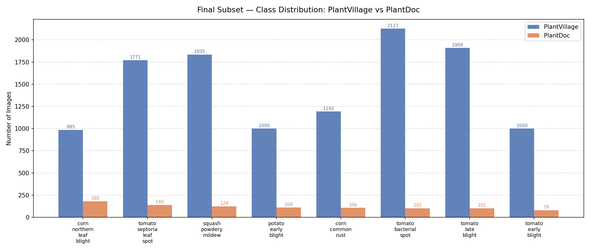

*Figure: Class distribution for the 8-class subset (summary also in
`outputs/results/final_subset_eda_summary.md` and `docs/FINAL_CLASS_SUBSET.md`).*

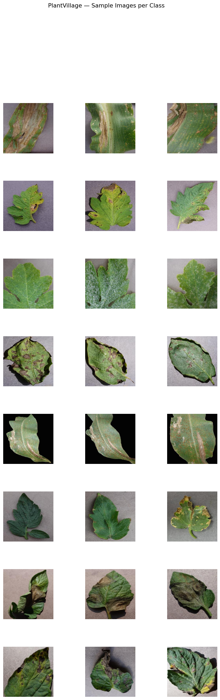

*Figure: Example PlantVillage images (laboratory-style, more uniform context).*

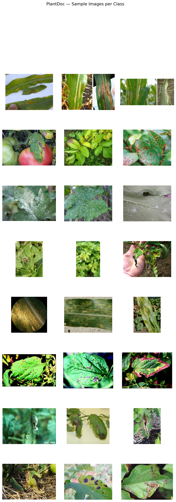

*Figure: Example PlantDoc images (more field-like variation).*

*Text summary of sizes and class counts:* `outputs/results/final_subset_eda_summary.md`.

### 6.2 BaselineCNN training runs (curves and per-run confusion matrices)

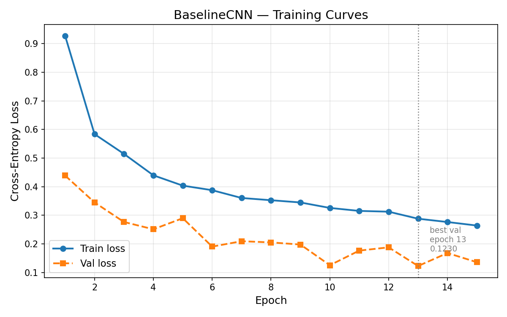

*Figure: Initial baseline training (pre–run-number file name) - 15 epochs, `lr=1e-3`.*

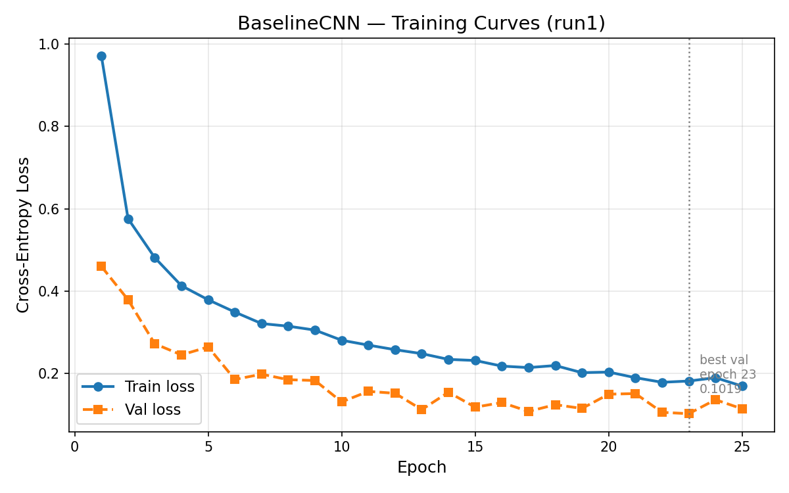

*Figure: Run 1 - `lr=3e-4`, 25 epochs.*

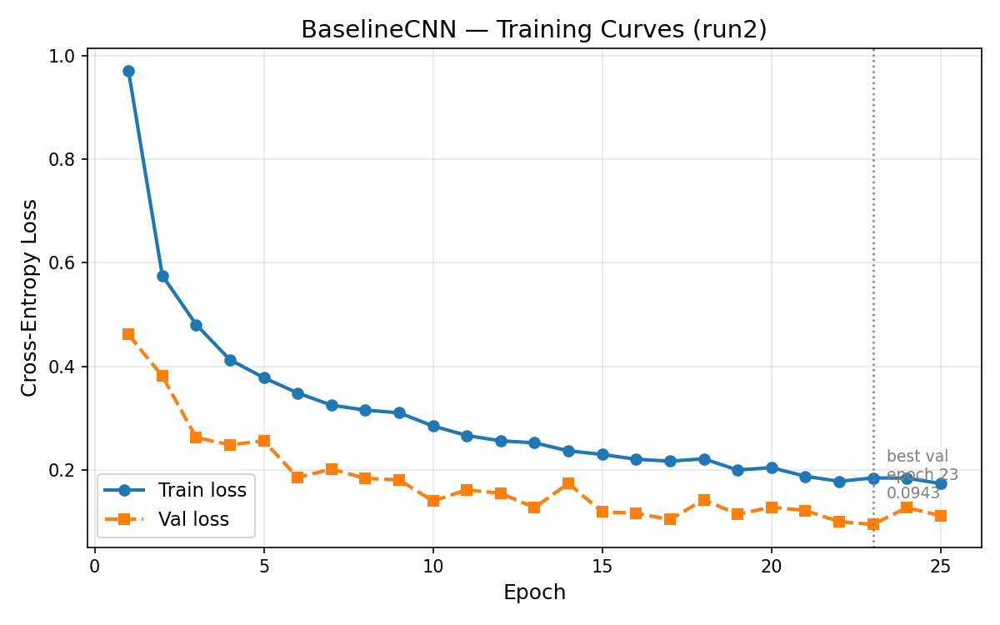

*Figure: Run 2 - + weight decay `1e-4`.*

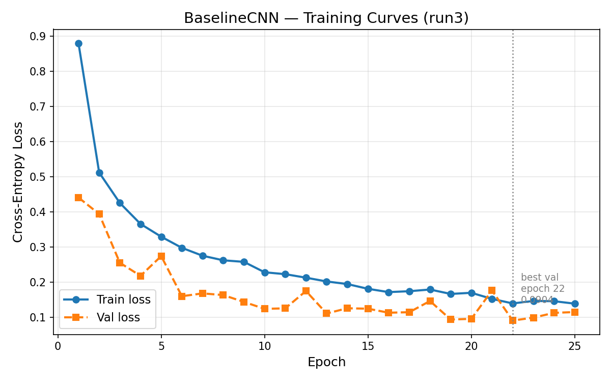

*Figure: Run 3 - + dropout 0.3; **selected** by best validation loss.*

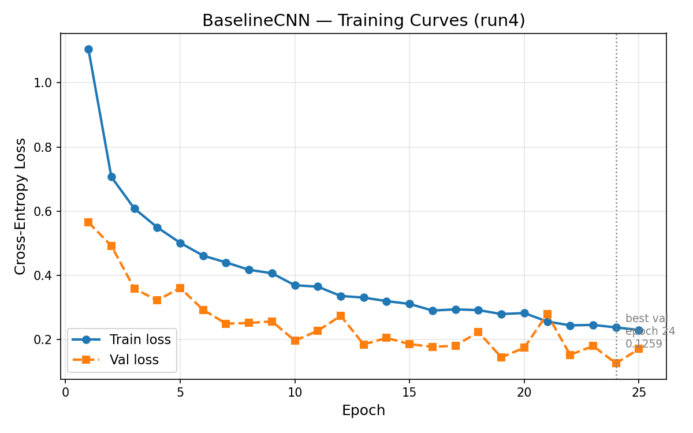

*Figure: Run 4 - stronger `ColorJitter` (rejected: worse validation).*

**Per-run confusion matrices** (saved at the end of each training run, not from the final
`evaluate_final.py` pass; see Section 6.4):
`outputs/figures/baseline_confusion_matrix.png`, `baseline_confusion_matrix_run1.png` through
`run4.png`.

### 6.3 ResNet-18 training (initial run)

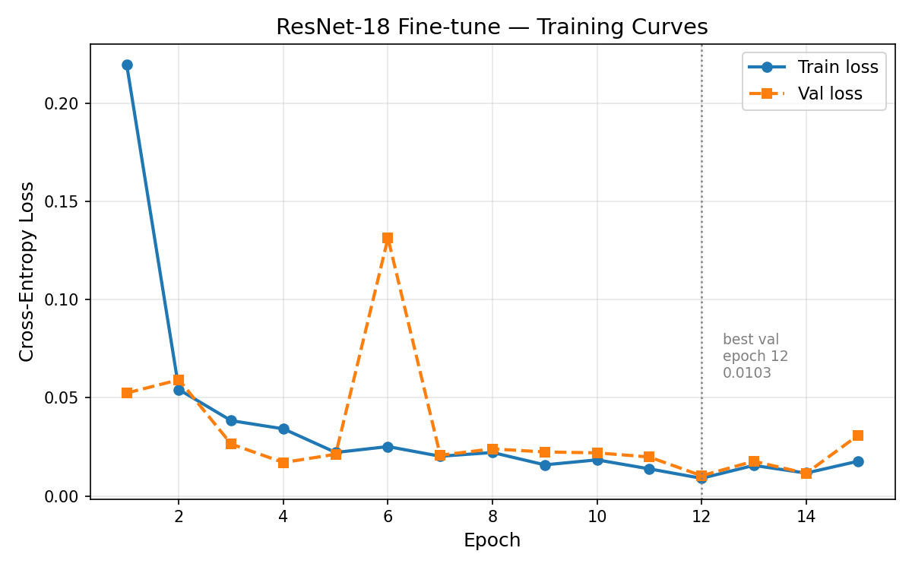

*Figure: ResNet-18 fine-tuning on PlantVillage (checkpoint `resnet18_best.pt` used in final
eval).*

**End-of-training** confusion from the ResNet-18 run (for reference; not the matrix from the
`evaluate_final.py` pass in Section 6.4):
`outputs/figures/resnet18_confusion_matrix.png`.

### 6.4 Confusion matrices from final evaluation (`evaluate_final.py`)

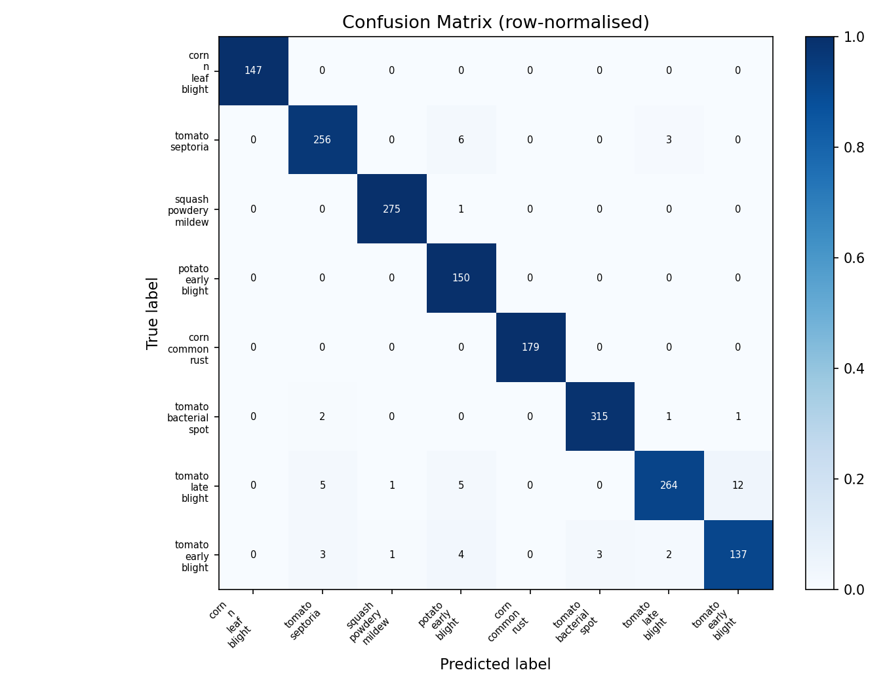

*Figure: **Final** Baseline run3 on **PlantVillage test** (from `evaluate_final.py`).*

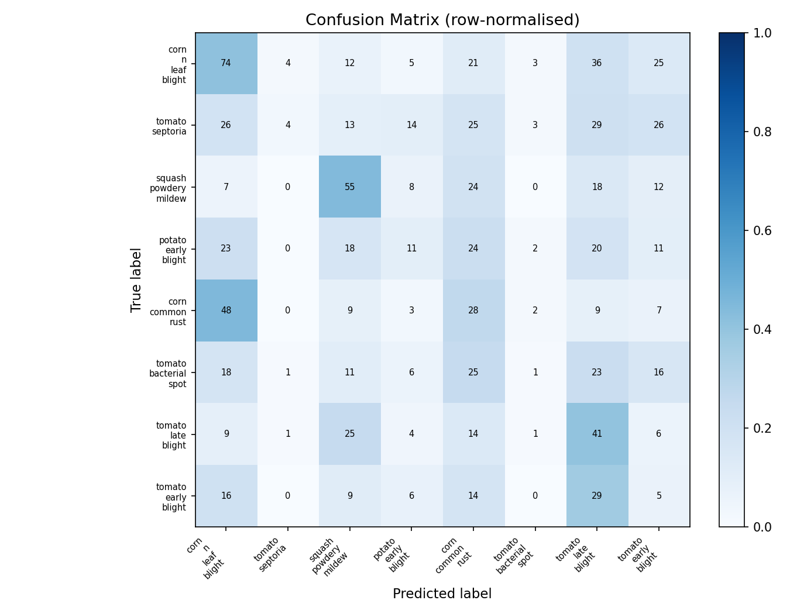

*Figure: **Final** Baseline run3 on **PlantDoc** - lower diagonal mass (domain shift).*

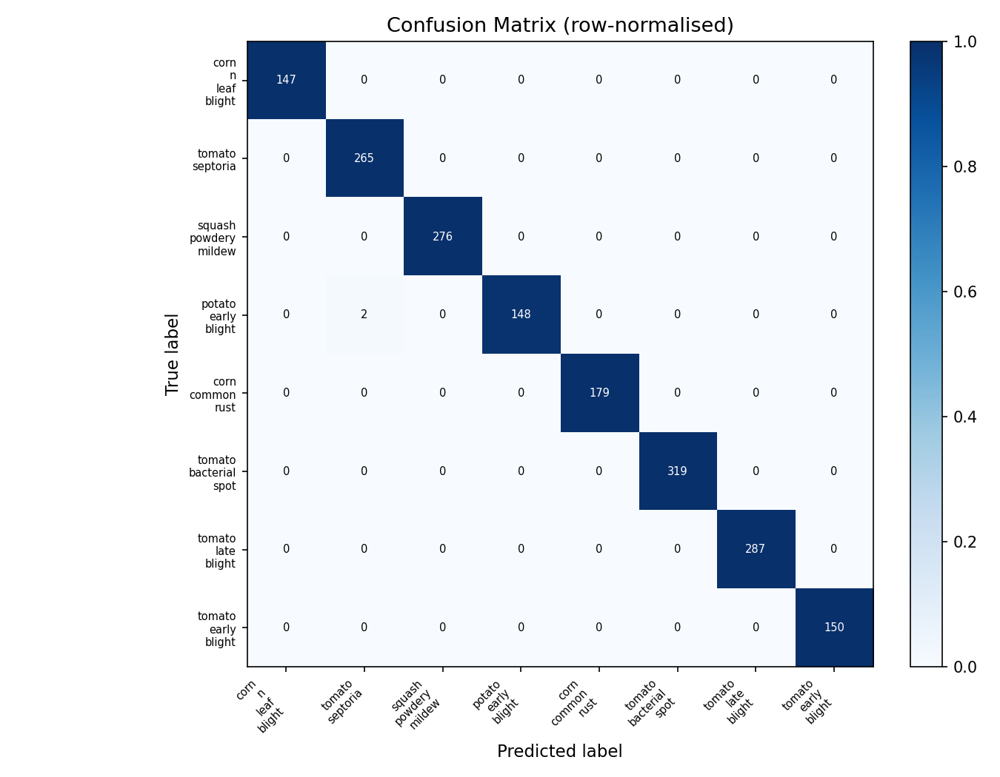

*Figure: **Final** ResNet-18 on **PlantVillage test**.*

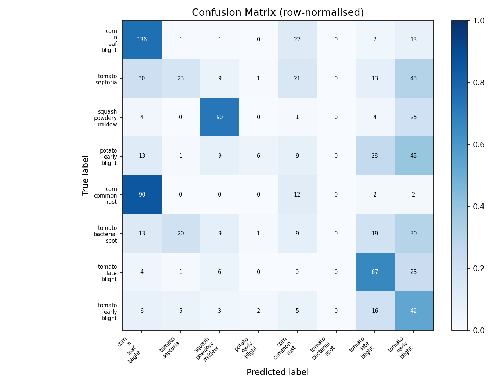

*Figure: **Final** ResNet-18 on **PlantDoc**; substantial off-diagonal error mass remains
despite higher mean accuracy than the baseline.*

**Class-level cell counts** are shown only in these PNGs in the current project layout; the
evaluation script did not write per-cell counts to CSV or JSON. The discussion in Section 7
relies on **visual inspection** of the figures and the **aggregate** metrics above. Exact
per-class confusion integers can be read from the figures or obtained by a separate export step
in future work.

---

## 7. Failure analysis (qualitative, from confusion matrices and aggregates)

- **Generalization gap (both models).** Aggregate accuracy falls from about **~97% / ~99%** on
  PlantVillage test to about **~23% / ~40%** on PlantDoc—a **substantial** shift, *consistent
  with* **strong domain shift** and **limited** transfer of rules learned on PlantVillage alone.
- **Fine-grained tomato classes** (e.g. **septoria**, **bacterial spot**, **early
  blight**): the PlantDoc matrices show **substantial** off-diagonal mass for several
  tomato-related rows, *suggesting* that **subtle** lesion patterns are **difficult to align**
  across datasets. **ResNet-18** can still exhibit **very poor** per-class accuracy on
  individual classes (e.g. **bacterial spot** in the final figure) **even** when **mean** accuracy
  exceeds the baseline.
- **Cross-species confusion** on PlantDoc: many errors place mass across **corn / tomato /
  potato / squash**—the model is not only confusing **similar diseases** on the same host,
  but also **host** and **context** in difficult images. This is *consistent with* **global** scene
  features **possibly** playing a role; it is **not** evidence that a single feature caused
  each error.
- **ResNet-18** improves the **mean** and **typical** class outcomes relative to the baseline
  but **still** shows **concentrated** error patterns (e.g. **rust** vs **leaf blight** in corn in
  the final PlantDoc matrix) and **very low** accuracy on some classes.

*Exact* off-diagonal integers should be read from the figures or from a **future** exported
matrix file.

---

## 8. Shortcut learning and generalization

- **High** PlantVillage test accuracy together with **low** PlantDoc accuracy is **evidence of
  dataset shift** and is **compatible with** models exploiting **in-distribution regularities**
  that do not hold in PlantDoc. It does **not** prove that “only background was used” or that
  every in-domain success was a shortcut.
- **Possible** non-disease, dataset-specific signals include: **clean background**, **centered
  leaves**, **controlled lighting and color balance**, **resolution and style**, and
  **collection-specific** artifacts. These may *co-vary* with class labels in PlantVillage more
  strongly than in PlantDoc.
- The **larger** gap for the custom CNN and the **higher** PlantDoc metrics for ResNet-18 are
  *consistent with* **transfer learning** helping **separate** disease-relevant structure from
  some nuisance variation - *without* identifying a single mechanism per prediction.

**Recommended phrasing** for claims about mechanism: *suggests*; *is consistent with*; *may
indicate*; *does not establish* a specific cue for individual predictions.

---

## 9. Conclusion and practical implications

### 9.1 Main findings

1. **ResNet-18** **transfers** better to PlantDoc than **Baseline run3** (higher PlantDoc
   accuracy and F1, smaller gaps; **Section 5**), but **both** models show a **large**
   generalization gap on this protocol.
2. **Tuning** the custom CNN (learning rate, training length, weight decay, dropout) **improved**
   PlantVillage validation and test metrics; **aggressive** color augmentation (run 4)
   **reduced** in-domain performance under the same selection rule.
3. **PlantDoc** was held out until **after** model selection, so the external results reflect
   **genuine** out-of-distribution evaluation on a **new** imaging context, not hyperparameters
   fit to PlantDoc.

### 9.2 Implication for “real-world” plant disease systems

> Models trained and selected **only** on a **clean, curated** set can report **excellent**
> in-domain test numbers yet still **underperform** on **field-like** data. **External**
> evaluation on **shifted** data is **essential** for claims about **deployment**; accuracy on
> one benchmark alone is **not** enough.

### 9.3 Future work (non-exhaustive)

- **More** real-world / field images in **training** (or a small field set mixed in).
- **Domain adaptation** or **self-supervised** pretraining on unlabeled field leaves.
- **Segmentation** or **leaf cropping** to **reduce** sensitivity to full-scene context (may
  reduce reliance on **global** background cues - to be **validated** empirically).
- **More careful** augmentation search (contrast: run4 vs run3) - *possibly* a middle ground.
- **Additional** external datasets beyond PlantDoc to test whether the gap is **general** or
  **collection-specific**.

---

## 10. File index (results and figures used in this document)

| Type | Path |
| --- | --- |
| Final comparison (JSON) | `outputs/results/final_comparison.json` |
| Baseline final eval (JSON) | `outputs/results/baseline_final_eval.json` |
| ResNet-18 final eval (JSON) | `outputs/results/resnet18_final_eval.json` |
| Baseline original results | `outputs/results/baseline_results.json` |
| Baseline run1 | `outputs/results/baseline_results_run1.json` |
| Baseline run2 | `outputs/results/baseline_results_run2.json` |
| Baseline run3 | `outputs/results/baseline_results_run3.json` |
| Baseline run4 | `outputs/results/baseline_results_run4.json` |
| EDA text summary | `outputs/results/final_subset_eda_summary.md` |
| Checkpoints (final) | `outputs/checkpoints/baseline_cnn_best_run3.pt`, `outputs/checkpoints/resnet18_best.pt` (not in git; from training or the [v1.0-checkpoints](https://github.com/Kyrie21323/Plant-Disease-Classification/releases/tag/v1.0-checkpoints) Release) |
| Confusion matrices (final evaluation) | `outputs/figures/baseline_*_confusion_matrix.png`, `resnet18_*_confusion_matrix.png` (see **Section 6.4**) |

---

*This report is documentation-only. Reported numerics, paths, and protocol are unchanged from the
completed project evaluation. Tables and figure references were prepared for the course
repository and GitHub rendering.*
